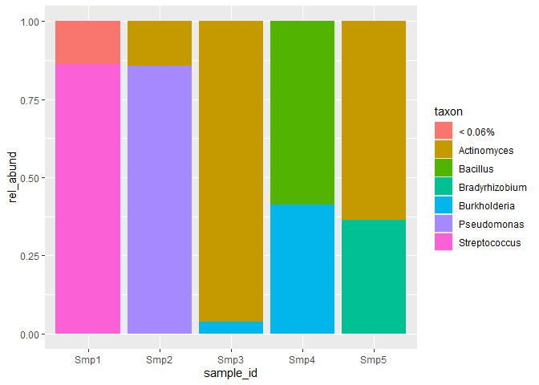

<!-- README.md is generated from README.Rmd. Please edit that file -->

# bubbler

<!-- badges: start -->
<!-- badges: end -->

The goal of bubbler is to generate amplicon sequencing bubble and
barplots that display community composition. This is a common
visualization in microbial ecology studies, but current implementations
are missing features, which has prompted me to develop bubbler. This
package works alongside [phyloseq](https://github.com/joey711/phyloseq)
and has been designed to work with data generated by
[dada2](https://github.com/benjjneb/dada2). Future versions are planned
to work with [qiime2](https://github.com/qiime2/qiime2) output.

Features

- Sum relative abundance by sample or variable.
- Filter by taxonomic level and optionally, specific samples.
- Pool taxa below a set threshold.
- Choose how many taxa you want to display.

Future Features

- Arrange taxa in ascending or descending order.
- *Italicize* genus and species-level taxonomies.

## Installation

You can install the development version of bubbler from
[GitHub](https://github.com/) with:

``` r
# install.packages("devtools")
devtools::install_github("zjardyn/bubbler")
```

## Example

Lets start by making a barplot from a toy amplicon dataset. We will
generate a relative abundance table, filter it at the taxonomic level of
genus and subset some samples of interest (a-c). Next, we will choose
how many taxa we want to display, which will set a threshold to pool our
taxa by (d). We then plot it with ggplot2.

``` r
library(bubbler)

a <- rel_abund(physeq1)
b <- choose_taxa_level(a, taxon_level = "Genus")
c <- choose_samples(b, smp_selection = c("Smp1", "Smp2", "Smp3", "Smp4", "Smp5"))

threshold <- choose_n_taxa(c, 6)
d <- pool_taxa(c, threshold)

d %>%
ggplot2::ggplot(ggplot2::aes(x = sample_id, y = rel_abund, fill = taxon)) +
    ggplot2::geom_bar(position = "fill", stat = "identity")
```



What is special about using `README.Rmd` instead of just `README.md`?
You can include R chunks like so:

``` r
summary(cars)
#>      speed           dist       
#>  Min.   : 4.0   Min.   :  2.00  
#>  1st Qu.:12.0   1st Qu.: 26.00  
#>  Median :15.0   Median : 36.00  
#>  Mean   :15.4   Mean   : 42.98  
#>  3rd Qu.:19.0   3rd Qu.: 56.00  
#>  Max.   :25.0   Max.   :120.00
```

You’ll still need to render `README.Rmd` regularly, to keep `README.md`
up-to-date. `devtools::build_readme()` is handy for this.

You can also embed plots, for example:


In that case, don’t forget to commit and push the resulting figure
files, so they display on GitHub and CRAN.
