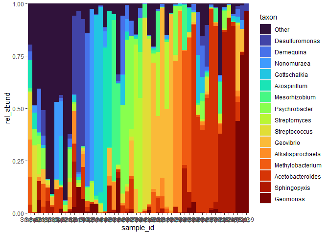

<!-- README.md is generated from README.Rmd. Please edit that file -->

# bubbler

<!-- badges: start -->
<!-- badges: end -->

bubbler generates amplicon sequencing bubble community composition
visualizations in the form of bubble and bar-plots. This is a common
visualization in microbial ecology studies, but current implementations
lack some useful features. This package leverages a
[phyloseq](https://github.com/joey711/phyloseq) object containing an ASV
table, taxonomy table, and optionally, a metadata file.  
You also import your own files generated from
[dada2](https://github.com/benjjneb/dada2), or
[qiime2](https://github.com/qiime2/qiime2).

Features

- Calculate relative abundance across variables of interest.  
- Choose taxonomic level specific samples.
- Pool taxa below a set threshold, or optionally, choose how many taxa
  you want to display.

Future Features

- Arrange samples and taxa.
- *Italicize* genus and species-level taxonomies.
- Use brewer and viridis colourschemes
- Generate global colourschemes, which are consistent between plots.
- Import multiple file types:
  - raw tables
  - physeq objects
  - qiime2 artifacts
  - biome files

## Installation

You can install the development version of bubbler from
[GitHub](https://github.com/) with:

``` r
# install.packages("devtools")
devtools::install_github("zjardyn/bubbler")
```

You will also need phyloseq, which can be installed with:

``` r
if(!requireNamespace("BiocManager")){
  install.packages("BiocManager")
}
BiocManager::install("phyloseq")
```

## Data Import

If you can get your data into a phyloseq object, it will work with
bubbler, see importing data from
[phyloseq](https://joey711.github.io/phyloseq/import-data.html)

## Simple example

We generate a relative abundance table, choosing the taxa level of
Genus. Lets compare it to phyloseq’s `plot_bar`. Relative abundance is
calculated as $r_i = \frac{x_i}{x}$ where $x_i$ is a species count,
divided by $x$ the total sum of all species.

``` r
library(bubbler)
library(phyloseq)
library(tidyverse)

a <- rel_abund(phy = physeq1, taxa_level = "Genus")
 
ggplot(a, aes(x = sample_id, y = rel_abund, fill = taxon)) +
    geom_bar(position = "stack", stat = "identity")

plot_bar(fill = "Genus")
```

 You
can normalize counts across a variable which results in a filled in
plot. Alternatively, you can set `geom_bar` argument `position` to
“fill”, which has the same effect.

``` r
a <- rel_abund_phy(phy = physeq1, taxa_level = "Genus", var = "sample_id")

ggplot(a, aes(x = sample_id, y = rel_abund, fill = taxon)) +
    geom_bar(position = "stack", stat = "identity")

# same plot
ggplot(a, aes(x = sample_id, y = rel_abund, fill = taxon)) +
    geom_bar(position = "fill", stat = "identity")
```


Relative abundance across a variable is calculated as
$r_i =\frac{x_{i,j}}{\sum_{i=1}^{n_j} x_{i,j}}$ where $x_{i,j}$ is the
grouped levels of that variable.

Let’s try this with the variable `Location`. By default, metadata is not
loaded, so we specify `meta_data` to be be TRUE. We also change the
x-axis value in the ggplot call.

``` r
a <- rel_abund_phy(phy = physeq1, 
               taxa_level = "Genus", 
               var = "Location",
               meta_data = TRUE)

ggplot(a, aes(x = Location, y = rel_abund, fill = taxon)) +
    geom_bar(position = "stack", stat = "identity")
```


Again, but not grouping the variable. This way we can see how the data
stacks up.

``` r
a <- rel_abund_phy(phy = physeq1, 
               taxa_level = "Genus", 
               meta_data = TRUE)

ggplot(a, aes(x = Location, y = rel_abund, fill = taxon)) +
    geom_bar(position = "stack", stat = "identity")
```


You can also make bubble plots!

``` r
ggplot(a, aes(x = sample_id, y = taxon, colour = Location)) +
    geom_point(aes(size = rel_abund))
```


Thorough Example 1

<!-- You'll still need to render `README.Rmd` regularly, to keep `README.md` up-to-date. `devtools::build_readme()` is handy for this. -->
<!-- In that case, don't forget to commit and push the resulting figure files, so they display on GitHub and CRAN. -->
