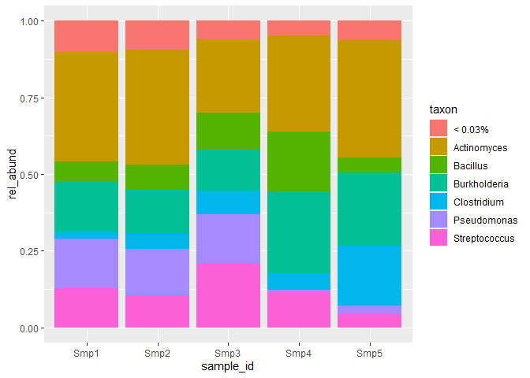
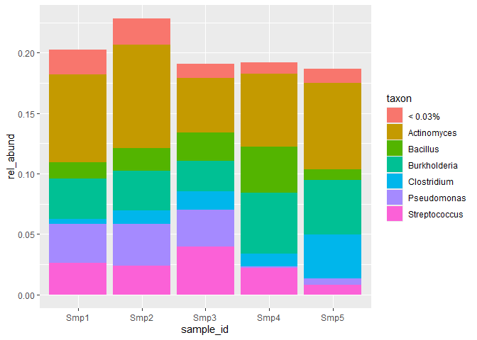

<!-- README.md is generated from README.Rmd. Please edit that file -->

# bubbler

<!-- badges: start -->
<!-- badges: end -->

bubbler generates amplicon sequencing bubble and barplots to visualize
community composition. This is a common visualization in microbial
ecology studies, but current implementations are hard to deeply
customize, which has prompted me to develop bubbler. This package works
alongside [phyloseq](https://github.com/joey711/phyloseq) and has been
designed to work with data generated by
[dada2](https://github.com/benjjneb/dada2). Future versions are planned
to work with [qiime2](https://github.com/qiime2/qiime2) output.

Features

- Calculate relative abundance by sample or variable.
- Filter by taxonomic level and optionally, specific samples.
- Pool taxa below a set threshold.
- Choose how many taxa you want to display.

Future Features

- Arrange samples and taxa.
- *Italicize* genus and species-level taxonomies.
- Use brewer and viridis colourschemes
- Generate global colourschemes, which are consistent between plots.
- Import multiple file types:
  - raw tables
  - physeq objects
  - qiime2 artifacts
  - biome files

## Installation

You can install the development version of bubbler from
[GitHub](https://github.com/) with:

``` r
# install.packages("devtools")
devtools::install_github("zjardyn/bubbler")
```

You will also need phyloseq, which can be installed with:

``` r
if(!requireNamespace("BiocManager")){
  install.packages("BiocManager")
}
BiocManager::install("phyloseq")
```

## Sample-wise plots

<!-- Lets start by making a barplot from a toy amplicon dataset. We will generate a relative abundance table, filter it at the taxonomic level of genus and subset some samples of interest (a-c). Next, we will choose how many taxa we want to display, which will set a threshold to pool our taxa by (d). We then plot it with ggplot2. To display 6 taxa, a threshold of 0.06% is set. -->

``` r
library(bubbler)
library(phyloseq)
library(ggplot2)

a <- rel_abund(phy = physeq1, taxa_level = "Genus", meta_data = FALSE)
sample_selection <- c("Smp1", "Smp2", "Smp3", "Smp4", "Smp5")
b <- choose_samples_rel_abund(a, sample_selection)
 
threshold <- choose_n_taxa(b, 6)
c <- pool_taxa(b, threshold)

c %>%
    ggplot(aes(x = sample_id, y = rel_abund, fill = taxon)) +
        geom_bar(position = "fill", stat = "identity")
```



<!-- The geom_bar uses the position argument of fill, which scales our bars to fill the y axis of rel_abund. While this looks good, we are missing information on relative abundances between samples. We can use position = "stack" to see this information.   -->

``` r
c %>%
ggplot(aes(x = sample_id, y = rel_abund, fill = taxon)) +
    geom_bar(position = "stack", stat = "identity")
```


<!-- Here we can see how samples stack up against each other. This can be informative if samples have large differences in abundance. -->

<!-- To pool, internally we are looking at the max value for a given taxon and, if that value is less than 0.06, it is pooled.  -->
<!-- A bubbleplot is just a variation of a stacked-barplot. We will change some of the arguments to display everything from our relative abundance table. We inner_join d with some metadata to colour by Location.  -->
<!-- ```{r bubble} -->
<!-- a <- rel_abund(physeq1) -->
<!-- # change taxon_level to Species, don't subset samples -->
<!-- b <- choose_taxa_level(a, taxon_level = "Species") -->
<!-- threshold <- choose_n_taxa(b, n_taxa = 12) -->
<!-- d <- pool_taxa(b, threshold) -->
<!-- d %>% -->
<!--     dplyr::inner_join(., bubbler::meta_data_phy(physeq1), by = "sample_id") %>% -->
<!-- ggplot2::ggplot(ggplot2::aes(x = sample_id, y = taxon, size = rel_abund)) + -->
<!--     ggplot2::geom_point(ggplot2::aes(colour = Location)) -->
<!-- ``` -->
<!-- ## Variable-wise plots -->
<!-- If you have a variable of interest from your metadata which you would rather use as the x-axis, you can use rel_abund_var to specify it. You must also specify it in pool_taxa. This is because pooling is computed across something, either your samples, or the levels of your variable.  -->
<!-- ```{r} -->
<!-- a <- rel_abund_var(physeq1, var = "Location") -->
<!-- b <- choose_taxa_level(a, taxon_level = "Genus") -->
<!-- threshold <- choose_n_taxa(b, 6) -->
<!-- c <- pool_taxa(b, threshold, var = "Location") -->
<!-- c %>% -->
<!-- ggplot2::ggplot(ggplot2::aes(x = Location , y = rel_abund, fill = taxon)) + -->
<!--     ggplot2::geom_bar(position = "fill", stat = "identity") -->
<!-- ``` -->
<!-- ```{r} -->
<!-- a <- rel_abund_var(physeq1, var = "Location") -->
<!-- b <- choose_taxa_level(a, taxon_level = "Genus") -->
<!-- threshold <- choose_n_taxa(b, 6) -->
<!-- c <- pool_taxa(b, threshold, var = "Location") -->
<!-- c %>% -->
<!-- ggplot2::ggplot(ggplot2::aes(x = Location , y = rel_abund, fill = taxon)) + -->
<!--     ggplot2::geom_bar(position = "stack", stat = "identity") -->
<!-- ``` -->
<!-- You'll still need to render `README.Rmd` regularly, to keep `README.md` up-to-date. `devtools::build_readme()` is handy for this. -->
<!-- You can also embed plots, for example: -->
<!-- ```{r pressure, echo = FALSE} -->
<!-- plot(pressure) -->
<!-- ``` -->
<!-- In that case, don't forget to commit and push the resulting figure files, so they display on GitHub and CRAN. -->
